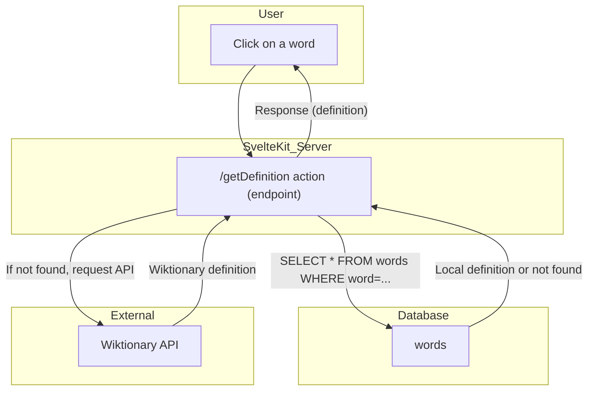
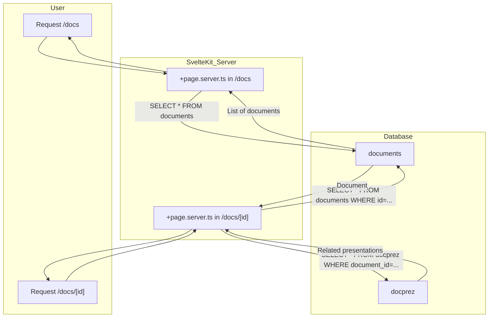

## Information flow: clicking a word (English)

# Information flow: routes `/docs` and `/docs/[id]`

This diagram shows how data flows between the user, the SvelteKit server, and the database when accessing the `/docs` and `/docs/[id]` routes.

## Information flow: clicking a word

