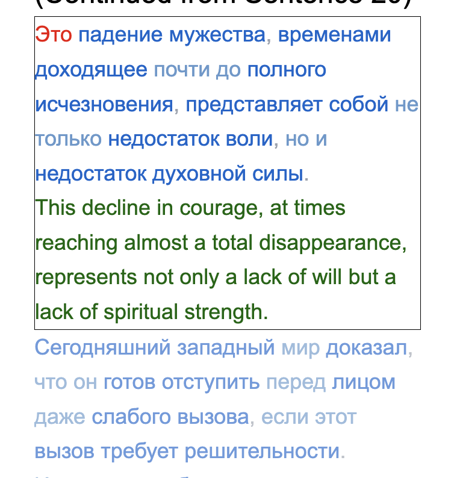
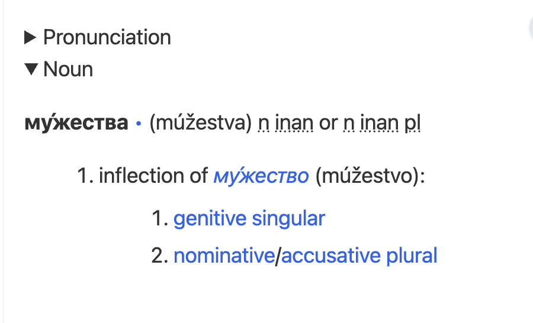

# SPC-Learn: Russian Language Learning Tool

This presentation is historical.
The original app was [vibe coded](https://en.wikipedia.org/wiki/Vibe_coding) in two weeks and there was a lot of cruft so I reboot it from a semi clean state. Probably when I get something working again (within 2 month?), I
will make it acessible on vercel [\[1\]](https://vercel.com/) [\[2\]](https://en.wikipedia.org/wiki/Vercel)
using its free tier, but I will have to upload the db as well because free tiers app on vercel are readonly.

## What I had got.

What is was doing was to allow to focus on a sentence. The rest was displayed  untranslated.



When clicking on a word, the wiktionary page was loaded, 
only the russion section (now the target language section) kept, and cached in a db.


the procesed witk page  was displayed in 
a side panel with only the translaction (sub)section expanded.



All of this will be kept but part of a more general app.

## Why scraping instead of using the wikimedia format

Parsing the wikimedia format is difficult and the skill of scraping an html page is more general. The risk is that the format can change without notice.
So I must save the db of loaded wiktionary words.

## What is going now.

The old flow of information is described [here](./flow.md).
It is getting more complicated.
A growing specification is [here](./spec.md).
The growing tech stack is [there](./tech-stack.md).
Expect typos and unfinished sentences.

### HTML and DOM

The raw html file has been produced by grok in this [session](https://grok.com/share/bGVnYWN5_59bc36d2-fabf-43d5-884f-98b79ba25038) when asking it to pair a sentence with its translation. So it has become the de facto format.
The relevant sections for the app are of the form.
They are then processed so each word is clickable.

```html
 <ol class="marker:text-secondary" start="21">
                  <li class="break-words">
                    <strong>Russian:</strong> Это падение мужества, временами
                    доходящее почти до полного исчезновения, представляет собой
                    не только недостаток воли, но и недостаток духовной силы.<br />
                    <strong>English:</strong> This decline in courage, at times
                    reaching almost a total disappearance, represents not only a
                    lack of will but a lack of spiritual strength.
                  </li>
                  ...
 </ol>
```

The processed html file breaks sentences into words like this.

```html
<span data-lang="ru" data-word="падение">падение</span>
```

When interacting with the user, style information is added to the [dom](https://en.wikipedia.org/wiki/Document_Object_Model), to show,
hide or emphasize stuff as seen per a copy of an element from [chrome devtools](https://developer.chrome.com/docs/devtools).
Here with the word "это" selected.

```html
<ol class="marker:text-secondary" start="21">
                  <li class="break-words" style="color: rgb(156, 163, 175); border: 1px solid black;">
                    <strong style="display: none;">Russian:</strong> <span data-lang="ru" data-word="это" data-common="true" style="display: inline; color: rgb(238, 0, 0);">Это</span> <span data-lang="ru" data-word="падение" style="display: inline;">падение</span> <span data-lang="ru" data-word="мужества" style="display: inline;">мужества</span>
                    ...
                  </li>
</ol>
```

Two sentences, one emphasized, the other not.


### wiktionary page processing

Before processing, the wiktionary page looks like this.
The processing will keep only the russian section, remove the edit buttons


After processing the page looks like this. The sections are now collapsible, with only the title visible when closed.
The translations sections are opened.


### Next

For inflected word We will display the non [inflected](https://en.wikipedia.org/wiki/Inflection) version as well. It is found in the span with class
`form-of-definition-link`.

```html
<span class="\&quot;form-of-definition-link\&quot;"><i class="\&quot;Cyrl" mention\"="" lang="\&quot;ru\&quot;"><a href="\&quot;/wiki/%D0%BF%D1%80%D0%B5%D0%B4%D1%81%D1%82%D0%B0%D0%B2%D0%BB%D1%8F%D1%82%D1%8C#Russian\&quot;" title="\&quot;представлять\&quot;">представля́ть</a></i> <span class="\&quot;mention-gloss-paren" annotation-paren\"="">(</span><span lang="\&quot;ru-Latn\&quot;" class="\&quot;mention-tr" tr="" latn\"="">predstavljátʹ</span><span class="\&quot;mention-gloss-paren" annotation-paren\"="">)</span></span>
```