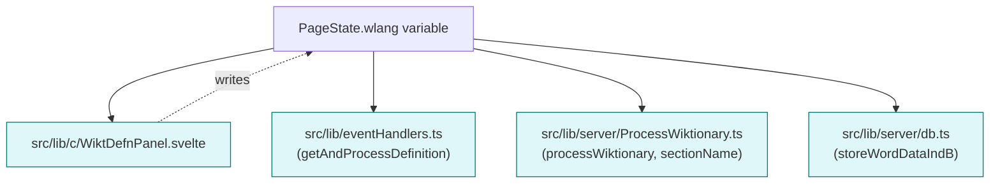

# pagestate.wlang Usage Chart

**Legend:**
- Blue nodes: files/functions that read `pagestate.wlang`
- Orange dashed arrows: files/functions that write to `pagestate.wlang`

**Notes:**
- `src/lib/c/WiktDefnPanel.svelte` both reads and writes `pagestate.wlang` (e.g., via language selection radio buttons).
- `getAndProcessDefinition` and related functions use it to fetch/process definitions.
- `processWiktionary` and `sectionName` use it to select Wiktionary sections.
- `storeWordDataIndB` uses it to store word data in the DB.
